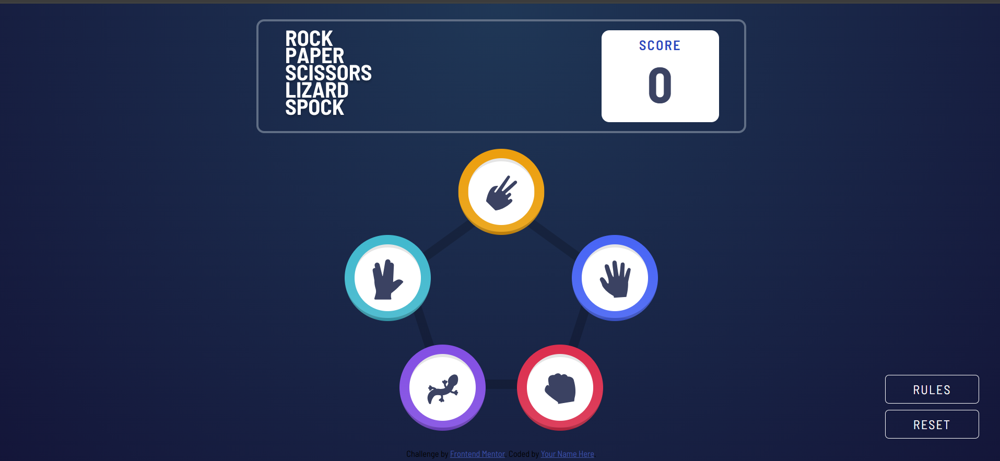

# Frontend Mentor - Rock, Paper, Scissors solution

This is a solution to the [Rock, Paper, Scissors challenge on Frontend Mentor](https://www.frontendmentor.io/challenges/rock-paper-scissors-game-pTgwgvgH). Frontend Mentor challenges help you improve your coding skills by building realistic projects.

## Table of contents

- [Overview](#overview)
  - [The challenge](#the-challenge)
  - [Screenshot](#screenshot)
- [My process](#my-process)
  - [Built with](#built-with)
  - [What I learned](#what-i-learned)
- [Author](#author)

## Overview

I created a Rock, Paper, Scissors, Lizard, Spock website using HTML, CSS, and JavaScript. The project expands on the classic Rock, Paper, Scissors game by including two additional choices—Lizard and Spock—to make the gameplay more dynamic. The interface is built with HTML for structure and CSS for styling, while JavaScript handles the game logic, player interactions, and result display. The site allows users to select their choice, compete against a computer opponent, and instantly see who wins, all within a simple, interactive, and responsive design.

### The challenge

Users are be able to:

- View the optimal layout for the game depending on their device's screen size
- Play Rock, Paper, Scissors, Lizard, Spock against the computer

### Screenshot

## My process

To put this project together, I started with an HTML-first approach, building out the full structure before moving on to styling. After that, I focused on CSS, creating all the necessary classes to handle the different game states and visual changes. For the functionality, I used JavaScript strictly to add or remove class names, ensuring that I avoided writing any inline styles or direct CSS manipulations in the script. This approach kept the separation of concerns clean—HTML for structure, CSS for presentation, and JavaScript for interactivity—while making the project more maintainable and scalable.

### Built with

- Semantic HTML5 markup
- CSS custom properties
- Flexbox
- Desktop-first workflow

### What I learned

How CSS transforms (e.g., translate(-50%, -50%)) can be used for clean positioning in layouts.

The difference between box-shadow placement (extending from the border vs. outline) and how it affects design.

The role of media queries in making a design responsive, and when screen is (and isn’t) necessary.

How separating structure (HTML), style (CSS), and behavior (JavaScript) makes the project easier to manage and scale.

## Author

CLARENCE SCOTT-EMUAKPOR
